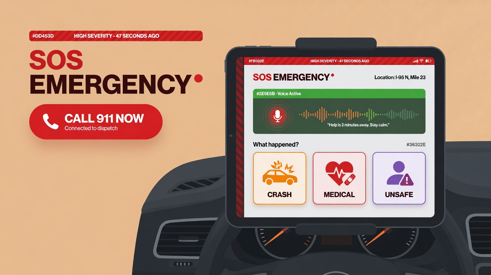
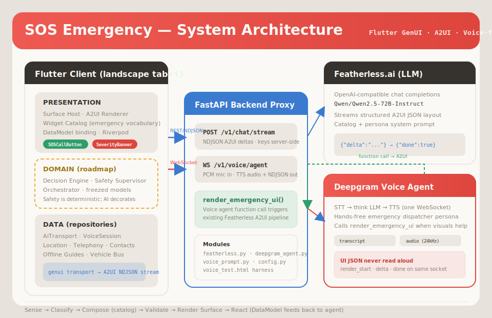

# SOS Emergency

[](https://pub.dev/packages/very_good_analysis)
[](LICENSE)
[](https://flutter.dev)
[](https://dart.dev)
[](https://pub.dev/packages/genui)
[](tech_spec.md)

**A generative-UI emergency co-pilot for landscape tablets in the car.** Instead of fixed menus, a built-in agent reads the situation and composes the right interface in real time — choosing content, layout, and the single safest next action from a design-owned widget catalog.

> Voice-first · Context-aware · Safety-first escalation · Flutter GenUI (A2UI)

---

## Table of contents

- [Overview](#overview)
- [The core bet](#the-core-bet)
- [MVP scenarios](#mvp-scenarios)
- [Status at a glance](#status-at-a-glance)
- [Architecture](#architecture)
- [Repository map](#repository-map)
- [Quick start](#quick-start)
- [Configuration](#configuration)
- [Testing & validation](#testing--validation)
- [Design system](#design-system)
- [Documentation & brainstorm sources](#documentation--brainstorm-sources)
- [Roadmap](#roadmap)
- [Privacy & safety constraints](#privacy--safety-constraints)
- [Contributing](#contributing)
- [License](#license)

---

## Overview

In a crisis behind the wheel, cognitive load spikes: panic, impaired fine motor control, and decision paralysis. Traditional apps — nested menus, fixed screens, lots of reading — fail exactly when they are needed most.

**SOS Emergency** (In-Car SOS) is a single emergency **Surface** on a landscape tablet (iPad / Android tablet; automotive head unit later). A built-in AI agent decides what to put on screen based on what is actually happening.

The product is built on **Generative UI (GenUI)**. The AI does not write Dart code or draw pixels at runtime. It acts as an **orchestrator**: it reads context and intent, then composes a layout by selecting from a fixed, design-owned **Widget Catalog** and streaming a structured layout description (**A2UI / JSON**) to the Flutter renderer. If a component is not in the catalog, the AI cannot produce it — which keeps brand, accessibility, and safety bounds intact while still letting the screen reshape itself for each situation.

### Three jobs, in order

1. **Identify** — Determine whether this is a car problem, crash, medical event, personal-safety threat, or environmental hazard — and how severe it is.
2. **Make safety effortless** — Put emergency services, live location sharing, and trusted-contact alerts within a single tap (or no tap at all). Never be clever before safety is handled.
3. **Assist & document** — Once immediate danger has passed, guide the user and help document the incident.

### Design principles (from product brainstorms)

- **Voice-first and low-friction** — Assume the user may be shaking, injured, driving, panicked, or unable to type.
- **Context-aware** — Use speed, GPS, vehicle connection, time of day, weather, battery, and location type to simplify the flow.
- **Escalation-oriented** — When danger is high, prioritize emergency services, trusted contacts, and live location sharing.
- **Documentation after safety** — Photos, notes, insurance, and reports matter — but only after the user is safe.
- **Never route home during threats** — For being followed or stalking concerns, route to a police station, fire station, or busy public place.
- **Safe defaults obvious** — Do not change a tire on a dangerous shoulder; do not chase a hit-and-run driver; do not continue driving after severe medical symptoms.

---

## The core bet

> The right interface for a flat tire, a serious crash, and a stalker following you home are completely different screens.

Rather than building and maintaining dozens of fixed flows, we give the AI a vocabulary of emergency components and let it assemble the right one for the moment — **always with the safest action largest and first**.

The architectural invariant (see [tech_spec.md](tech_spec.md)):

> **Safety is deterministic. The AI only decorates.**

The LLM is treated as an *untrusted, best-effort, possibly-slow, possibly-offline* component. Emergency call placement, location sharing, threat routing, and crash escalation are owned by a deterministic decision engine and safety supervisor — not the model.

---

## MVP scenarios

The hackathon MVP targets eight high-frequency, high-stakes situations from the scenario brainstorms:

| Scenario | Typical car state | Severity | Primary app loop |
|----------|-------------------|----------|------------------|
| Flat tire / blowout | Driving → parked | High | Safe pull-over guidance, roadside assist, share location |
| Car won't start | Parked | Moderate | Jump-start checklist, fuel/charger locator, tow summary |
| Serious crash | Parked | Critical | Auto-escalation countdown, 911, notify contacts, I'm-safe abort |
| Medical emergency (e.g. heart attack symptoms) | Driving or parked | Critical | Stop-driving guidance, 911, medical ID, contact alerts |
| Being followed / road rage | Driving | Critical | Safe-route to police precinct, live location, no "route home" |
| Locked out (child/pet inside) | Parked | Critical | 911 path, temperature danger alerts, unlock guidance |
| Out of gas / EV low | Driving → parked | Moderate | Nearest station/charger, roadside assist |
| Unsafe parked location | Parked | High | Well-lit public place routing, share location, check-in |

Opening triage presents a low-friction choice grid: car problem, crash, medical, I feel unsafe, being followed, locked out, roadside help, document incident — plus push-to-talk voice entry.

---

## Status at a glance

| Area | Status | Notes |
|------|--------|-------|
| Widget catalog & A2UI renderer | **Implemented** | Emergency components in `lib/presentation/catalog/` |
| Design tokens (day/night, severity tiers) | **Implemented** | `lib/app/theme/sos_tokens.dart`, [design doc](docs/design/sos_design_system.md) |
| Golden screen fixtures | **Implemented** | Opening triage, crash, being followed, medical, won't-start |
| GenUI session + Featherless client | **Implemented** | Direct Featherless streaming from Flutter |
| FastAPI backend proxy | **Implemented** | Chat stream + voice agent; keys server-side |
| Deepgram voice agent + A2UI bridge | **Implemented** | `render_emergency_ui` → Featherless pipeline |
| Browser voice/chat harness | **Implemented** | `backend/voice_test.html` |
| Decision engine & safety supervisor | **Roadmap** | Spec'd in [tech_spec.md](tech_spec.md) Phase 0–2 |
| Live telephony / GPS / vehicle bus | **Roadmap** | Repository interfaces planned |
| Automotive head-unit projection | **Roadmap** | Phase 5 in tech spec |
| Offline-first guide packs | **Partial** | Catalog fallbacks; full offline engine TBD |

---

## Architecture

High-level data flow: the Flutter client hosts a GenUI **Surface**; the backend holds API keys and bridges voice to the same A2UI pipeline used for chat.



### GenUI pillars (from design research)

| Pillar | Role in SOS Emergency |
|--------|-------------------------|
| **Surface** | Full-screen landscape emergency canvas; persistent SOS rail |
| **Catalog** | Design-owned emergency widget vocabulary (911, severity, maps, checklists…) |
| **DataModel** | Client-side state fed back to the agent on each interaction loop |
| **Transport** | NDJSON A2UI stream (REST via backend or direct Featherless) + WebSocket voice |

### Backend endpoints

| Endpoint | Purpose |
|----------|---------|
| `GET /health` | Service health |
| `POST /v1/chat/stream` | Stream A2UI NDJSON deltas from Featherless |
| `GET /v1/voice/health` | Voice layer readiness (Deepgram key configured) |
| `WS /v1/voice/agent` | Full-duplex voice: PCM in, TTS + A2UI events out |

See [backend/README.md](backend/README.md) and [backend/VOICE_AGENT_SPEC.md](backend/VOICE_AGENT_SPEC.md) for wire contracts.

---

## Repository map

```
.
├── lib/
│   ├── app/                    # MaterialApp, SOS theme tokens
│   ├── domain/models/          # A2UI node models (freezed)
│   ├── data/ai_transport/      # AI transport repository (mock + interface)
│   ├── presentation/
│   │   ├── catalog/            # Emergency widget catalog (the AI vocabulary)
│   │   └── surface/            # Surface host, A2UI renderer, DataModel
│   ├── model/                  # ModelClient + Featherless implementation
│   ├── home_page.dart          # Demo GenUI session screen
│   └── conversation.dart       # GenUiSession pipeline
├── backend/
│   ├── app/                    # FastAPI: chat stream, voice agent, config
│   ├── voice_test.html         # Browser harness for chat + voice
│   └── spec/                   # Voice agent design notes
├── docs/
│   ├── assets/                 # README banner + architecture.svg
│   ├── brainstorm/             # Product & GenUI research PDFs + notes
│   └── design/                 # SOS design system extraction
├── test/
│   ├── golden/                 # Visual regression for key screens
│   └── fixtures/               # Hand-authored A2UI scenario JSON
└── tech_spec.md                # Full engineering spec & phased plan
```

---

## Quick start

### Prerequisites

- **Flutter SDK** with Dart `^3.12.1` ([install guide](https://docs.flutter.dev/get-started/install))
- **Python 3.10+** for the backend proxy
- API keys: [Featherless](https://featherless.ai) (chat/A2UI), [Deepgram](https://deepgram.com) (voice — backend only)

### 1. Flutter app (desktop demo)

```powershell
# From project root
flutter pub get
dart run build_runner build --delete-conflicting-outputs

# Windows desktop (enable once if needed)
flutter config --enable-windows-desktop
flutter run -d windows --dart-define=FEATHERLESS_API_KEY=your_featherless_key
```

The demo renders a GenUI surface on the left and raw A2UI JSON on the right. Use the text input to describe an emergency scenario and watch the model compose catalog widgets.

> **Security note:** `--dart-define` embeds the key in the local build. For production or demos, prefer the backend proxy so keys never ship in the app binary.

### 2. Backend proxy (recommended for keys + voice)

```powershell
cd backend
python -m venv .venv
.\.venv\Scripts\Activate.ps1
pip install -r requirements.txt
Copy-Item .env.example .env
# Edit .env: FEATHERLESS_API_KEY, DEEPGRAM_API_KEY

uvicorn app.main:app --reload --port 8000
```

Health checks:

```powershell
curl http://localhost:8000/health
curl http://localhost:8000/v1/voice/health
```

### 3. Voice test harness (no Flutter build)

```powershell
cd backend
python -m http.server 7861
# Open http://localhost:7861/voice_test.html (mic requires localhost)
```

Serve `voice_test.html` while the FastAPI server runs on port 8000. The harness exercises chat streaming and the voice agent WebSocket.

---

## Configuration

### Flutter compile-time defines

| Define | Default | Purpose |
|--------|---------|---------|
| `FEATHERLESS_API_KEY` | _(empty)_ | Direct Featherless access from `FeatherlessModelClient` |
| Model override | `Qwen/Qwen2.5-72B-Instruct` | Constructor / client default |

### Backend environment (`.env`)

| Variable | Required | Purpose |
|----------|----------|---------|
| `FEATHERLESS_API_KEY` | Yes (chat) | OpenAI-compatible completions for A2UI |
| `DEEPGRAM_API_KEY` | Yes (voice) | Deepgram Voice Agent WebSocket |
| `FEATHERLESS_MODEL` | No | Override default model slug |
| `CORS_ORIGINS` | No | Allowed browser origins for voice harness |

Copy [backend/.env.example](backend/.env.example) to `backend/.env`. **Never commit `.env`.**

---

## Testing & validation

Run the full quality gate from the project root:

```powershell
dart run build_runner build --delete-conflicting-outputs
dart analyze
dart format .
flutter test
```

Golden tests reproduce design-handoff screens at tablet landscape breakpoints:

```powershell
flutter test test/golden/
```

Key fixtures live in [test/fixtures/sos_screens.dart](test/fixtures/sos_screens.dart) — hand-authored A2UI JSON composed entirely from registered catalog components.

---

## Design system

Visual language: **soft, tactile, premium-medical** — calm-but-urgent, glanceable, voice-first. Severity is conveyed by hue, glyph, border weight, and motion — never color alone.

| Token | Day value | Usage |
|-------|-----------|-------|
| Ground | `#E7E2DB` | App background |
| Surface | `#FBF9F6` | Cards, panels |
| Text | `#36322E` | Primary copy |
| Safe | `#2E9E6B` | Positive / completed actions |
| Critical | `#DD453D` | Highest severity tier |

Typography: **Hanken Grotesk** (display/body), **JetBrains Mono** (telemetry, ETAs, countdowns).

Full catalog and component specs: [docs/design/sos_design_system.md](docs/design/sos_design_system.md).

### Screen gallery (golden references)

| Screen | Fixture key |
|--------|-------------|
| Opening triage | `opening_triage_day` |
| Serious crash (critical) | `serious_crash_day` / `serious_crash_night` |
| Being followed (high, driving) | `being_followed_day` |
| Suspected heart attack | `suspected_heart_attack_day` |
| Won't start (offline) | `wont_start_offline_day` |

Golden PNGs: [test/golden/goldens/](test/golden/goldens/).

---

## Documentation & brainstorm sources

Product vision and scenario research that shaped this repo:

| Document | Contents |
|----------|----------|
| [InCar_SOS_GenUI_Product_Design.pdf](docs/brainstorm/InCar_SOS_GenUI_Product_Design.pdf) | Product framing, GenUI core bet, MVP scope |
| [car_emergency_app_scenario_brainstorm.pdf](docs/brainstorm/car_emergency_app_scenario_brainstorm.pdf) | Scenario categories, safety principles, triage choices |
| [incar_emergency_assistant_brainstorming.pdf](docs/brainstorm/incar_emergency_assistant_brainstorming.pdf) | Scenario matrix, threat tiers, action loops |
| [flutter_genui_design_research_doc.pdf](docs/brainstorm/flutter_genui_design_research_doc.pdf) | Surface, Catalog, DataModel, Transport pillars |
| [2026-06-24-featherless-model-client-brainstorm-doc.md](docs/brainstorm/2026-06-24-featherless-model-client-brainstorm-doc.md) | Featherless `ModelClient` integration decisions |
| [tech_spec.md](tech_spec.md) | Engineering architecture, safety supervisor, phased plan |
| [backend/VOICE_AGENT_SPEC.md](backend/VOICE_AGENT_SPEC.md) | Voice ↔ A2UI bridge specification |

---

## Roadmap

Phased delivery (detail in [tech_spec.md](tech_spec.md)):

1. **Phase 0–1** — Deterministic safety shell, catalog, renderer, golden screens *(in progress)*
2. **Phase 2** — Context fusion (location, vehicle state, connectivity)
3. **Phase 3** — AI composer with supervisor validation and offline fallbacks
4. **Phase 4** — Voice-first hands-free loop integrated in Flutter Surface
5. **Phase 5** — Automotive head-unit / projection targets

---

## Privacy & safety constraints

- **Not a replacement for emergency services.** The app routes and assists; it does not diagnose or give medical/legal advice.
- **API keys** belong in `backend/.env` or local `--dart-define` — never in source control.
- **Location, contacts, and call placement** will require explicit platform permissions when live integrations ship.
- **Threat scenarios** enforce safe routing rules (e.g. no "navigate home" when being followed).

---

## Contributing

This repo follows feature-first clean architecture with **Riverpod (codegen), Freezed, go_router, and the repository pattern**. See [AGENTS.md](AGENTS.md) and [CLAUDE.md](CLAUDE.md) for agent and contributor conventions.

Invariants to preserve:

- Widget catalog is the AI's only vocabulary — register components before prompting the model to use them.
- Safety-critical actions stay deterministic and one-tap reachable.
- Landscape tablet is the canonical design surface; test at those breakpoints first.
- Regenerate code (`build_runner`) after editing `@riverpod`, `@freezed`, or `@JsonSerializable` files.

---

## License

[MIT License](LICENSE) — Copyright (c) 2026 Very Good Ventures.